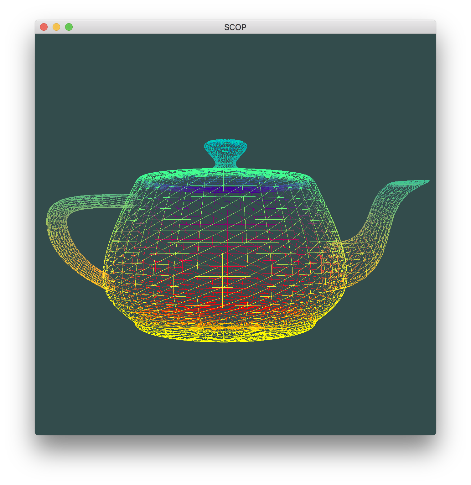
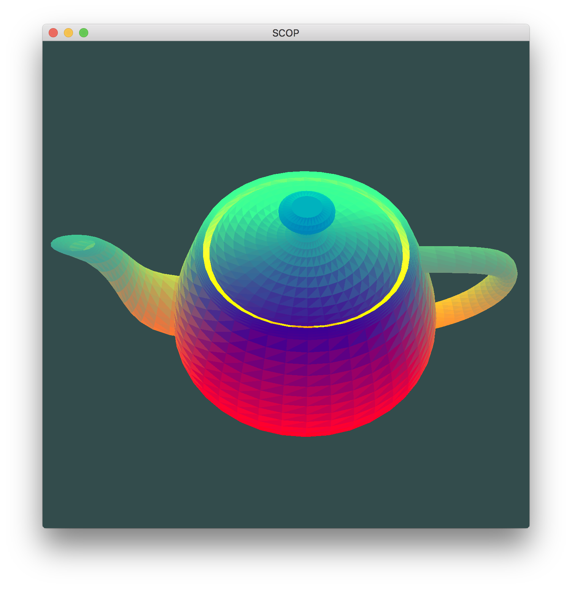
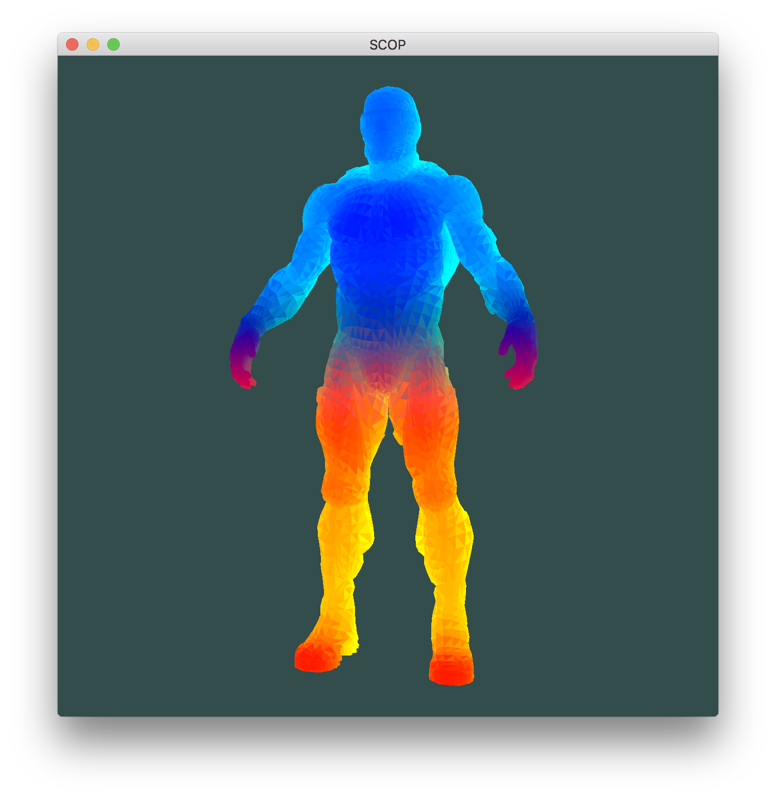

The goal of this project is to create a small program that will show a 3D object which stored in a `.obj` file.  
This mini project is a first step towards the use of OpenGL.  

Build from command line using `make`.  

To move object use `a`, `s`, `w`, `d`, `q`, `e`  
To rotate an object around the horizont axis use `f` and `c`,
around the vertical axis `r` and `t` or mouse.  

